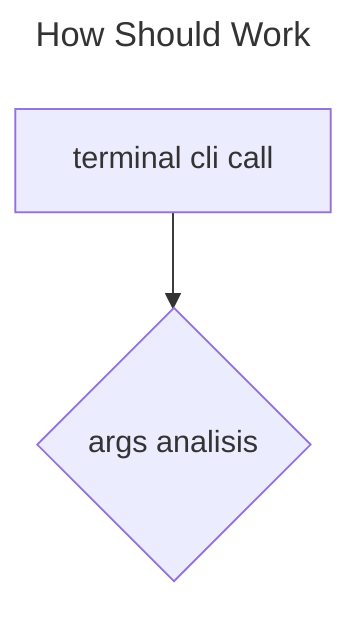

# Insomnie

Insomnie is a lightweight CLI and TUI HTTP client for developers. Inspired by big projects like Postman, Insomnia, Bruno, Cartero, curl and httpie, but with a minimalist text-based interface. Test and debug APIs quickly with an intuitive and customizable tool.

Insomnie is the french translation of insomnio (from the spanish) and is a kind of joke about the rest translation to the spanish (descansar).

## Installation

### requirements

- node lts >= 20
- npm bins path on your OS Path

```shell
npm i -g insomnie
```

## Notes

This is under active development and is not stable (but is usable) so is probable
get some breaking changes in the future.

Right now only this features are working :

- [x] CLI request using args config
- [x] check healt to multiple paths using args config
- [ ] Env variables from a local file
- [ ] Env variables from a global file
- [ ] CLI request using local file
- [ ] TUI request
- [ ] TUI request using envs
- [ ] TUI request from a file

## Usage

### On terminal

just calling directly from your terminal.

```shell
insomnie --help # should display full cli help


# check health (like a ping)
insomnie -u https://pokeapi.co/api/v2/ -chk

# GET request
insomnie -u https://pokeapi.co/api/v2/

insomnie -u https://jsonplaceholder.typicode.com/posts/100

# POST request
insomnie -u https://jsonplaceholder.typicode.com/posts/ -t post -B "{\"userId\": 22, \"title\":\"my task\" }"
```

### Text User Interface

WIP

## Project Focuses

### KISS - Keep it simple, stupid

This project should be easy to read and to use i prefer something simple and lightweight rather than something complex and heavy even if this makes a bit less friendly the UX, im assuming this is used by professionals.

If this is easy to read and use then is easy to fork and extend.

Written on the most popular language to fit better.

### Cutting Edge

Use latest (stable) technologies is a must so if you can improve something with a brand new feature or lib just open a issue explaining it.

Current tech stack:

- node >= 22
- esbuild
- node native fetch
- top level await
- ...

### Terminal And Local First

Boot up a heavy UI or use something extremly simple like curl to request a api is not enough.

Ui solutions are very heavy in memory and boot time when you just want a simple get request to double check besides this you require a graphic environment.

Cli solutions (at least right now 2024/09) are not compatible with envs and files or they are super simple like curl, this is not bad but i miss some advanced features like env, pretty print and Text User Interface.

## what i want to do

### requirement - spanish alert

quiero un cliente rest que pueda funcionar tanto de forma global como de forma local, es decir por cada proyecto tener una configuracion "local" dicho cliente rest debe tener las siguientes caracteristicas inspiradas por clientes grandes como (postman, postwoman o insomnia) pero sobre una interfaz de texto (TUI).

- uso de variables de entorno
- previsualizacion rapida de resultados
- uso de colores en estados
- workspaces
- workspace general
- carpetas o conjuntos de peticiones
- la configuracion de la ultima ejecucion se guarda para recuperarla en la siguiente ejecucion
- configuraciones de los headers
- support for rest and gql

ademas quiero incluir las siguientes caracteristicas

- es un cli y tiene una tui
- como cli quiero poder correr un conjunto de peticiones o todo el workspace/proyecto
- tanto en tui como en cli debo poder tener un historial segun la peticion
- hotkeys para ejecutar las peticiones rapidas
- el tui debe tener un api para poder solicitarle de forma externa que corra de forma automatica la peticion (eje cuando el back se reconstruya incluir un curl al final que le solicite al tui hacer fetch)
- como cli debo poder exportar y importar mis endpoints locales a formatos tipo json o similares para ser compatible con otros sistemas
- poder guardar de forma local (por proyecto) los endpoints del proyecto
- la ejecucion batch de peticiones guarda el ultimo estado en el historial
- el tui trabaja con una peticion a la vez

caracteristicas que veo posibles y seria cool tener pero no son esenciales

- performance analisis tipo jmeter basado en multiples peticiones
- cambiar el request engine
  - por ahora usa js pero poder cambiar a un engine escrito en java, go o rust puede traenornos nuevas ventajas

## Road Map

- clean the mess
  - i just released ASAP v1 and is not clean enough, lets clean this :D
- cli output fix
  - table is heavy lets send body as json simple log
  - automatic table width using terminal size or a param
- cli file read
  - env current dir file
  - json payloads
  - full request using file (in current dir)
- quick integrations
  - json hero <https://github.com/triggerdotdev/jsonhero-web>
- make TUI work
  - simple tui request
- reading from file

### not documented nice to have (looking very possible)

- jq looks good integration
- json crack
- pack request
  - a packed request is a "compiled" standalone request json file to just send to a friend and reproduce request

## How should work



## Notes

### Sqlite

i removed sqlite because is hard to compile is some non common environmnets (pythopn  distutils in python >3.11 and node gyp)

is not in the roadmap anymore but if want to use it in the future lets use node or bun built in sqlite client.
